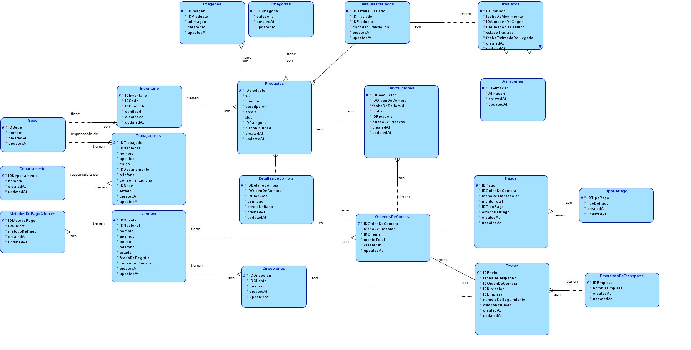
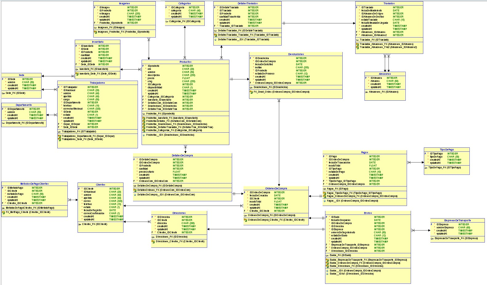
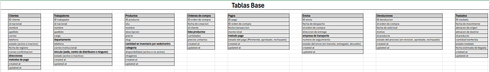
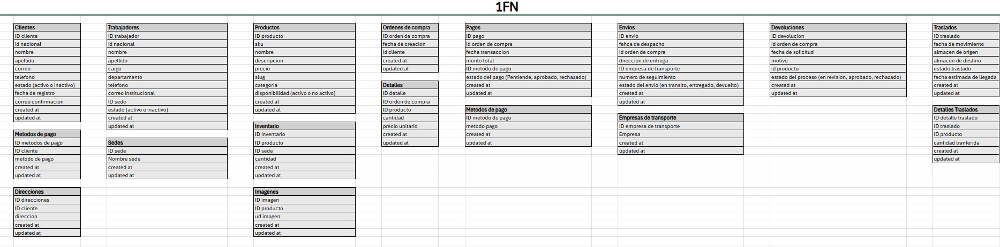
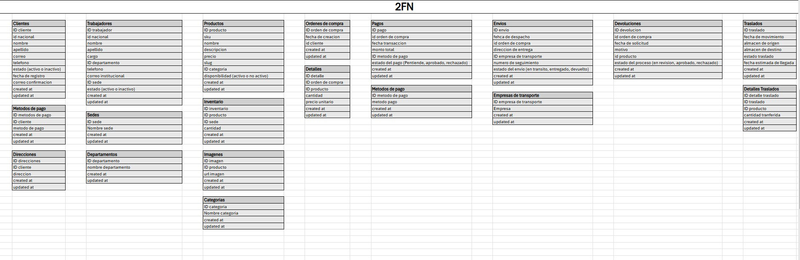
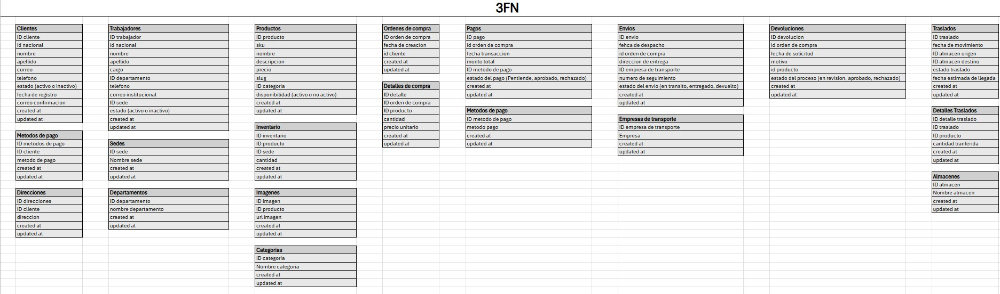
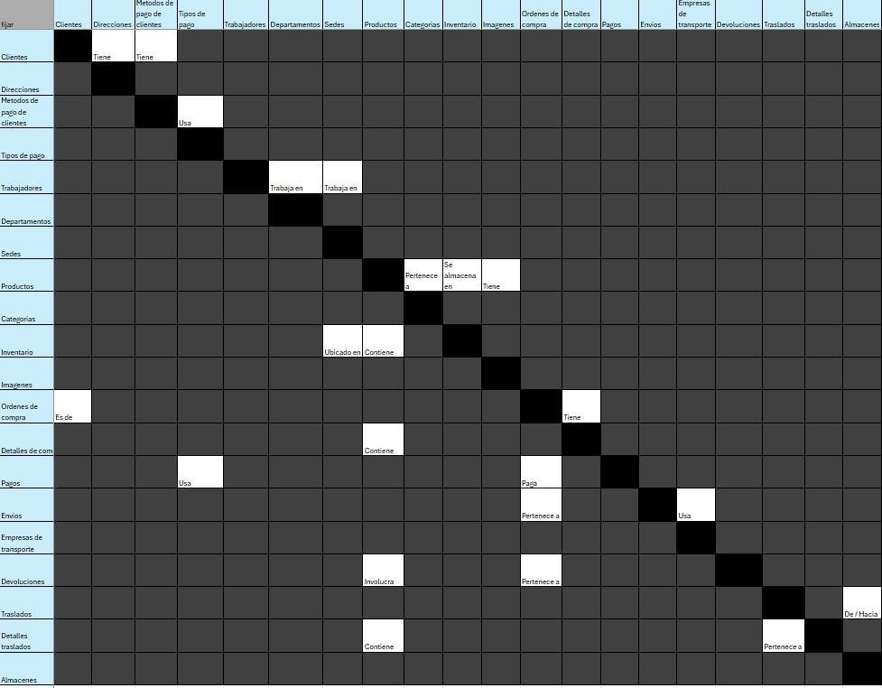

# Manual Técnico

## Esquema Conceptual

## Esquema Lógico

## Esquema Físico

## Fases del Proceso de Normalización
### Tablas base

### 1FN (Primera Forma Normal)

### 2FN (Segunda Forma Normal)

### 3FN (Tercera Forma Normal)

### Matriz

## 6. Descripción de las Tablas

### Clientes
| Campo               | Tipo de Dato         | Restricciones |
|---------------------|---------------------|--------------|
| IDCliente          | NUMBER (IDENTITY)    | PRIMARY KEY  |
| IDNacional         | VARCHAR2(20)         | UNIQUE, NOT NULL |
| nombre             | VARCHAR2(40)         | NOT NULL     |
| apellido           | VARCHAR2(40)         | NOT NULL     |
| correo             | VARCHAR2(320)        | NOT NULL     |
| telefono           | VARCHAR2(15)         | NOT NULL     |
| estado             | VARCHAR2(1)          | CHECK ('1', '0'), NOT NULL |
| fechaDeRegistro    | TIMESTAMP            | DEFAULT SYSTIMESTAMP, NOT NULL |
| correoConfirmacion | VARCHAR2(1)          | CHECK ('1', '0'), NOT NULL |
| createdAt          | TIMESTAMP            | DEFAULT SYSTIMESTAMP, NOT NULL |
| updatedAt          | TIMESTAMP            | DEFAULT SYSTIMESTAMP, NOT NULL |

---

### Trabajadores
| Campo               | Tipo de Dato         | Restricciones |
|---------------------|---------------------|--------------|
| IDTrabajador       | NUMBER (IDENTITY)    | PRIMARY KEY  |
| IDNacional         | VARCHAR2(20)         | UNIQUE, NOT NULL |
| nombre             | VARCHAR2(40)         | NOT NULL     |
| apellido           | VARCHAR2(40)         | NOT NULL     |
| cargo              | VARCHAR2(50)         | NOT NULL     |
| IDDepartamento     | NUMBER               | NOT NULL, FOREIGN KEY (Departamentos) |
| telefono           | VARCHAR2(15)         | NOT NULL     |
| correoInstitucional | VARCHAR2(320)       | NOT NULL     |
| IDSede             | NUMBER               | NOT NULL, FOREIGN KEY (Sedes) |
| estado             | VARCHAR2(1)          | CHECK ('1', '0'), NOT NULL |
| createdAt          | TIMESTAMP            | DEFAULT SYSTIMESTAMP, NOT NULL |
| updatedAt          | TIMESTAMP            | DEFAULT SYSTIMESTAMP, NOT NULL |

---

### Productos
| Campo               | Tipo de Dato         | Restricciones |
|---------------------|---------------------|--------------|
| IDProducto         | NUMBER (IDENTITY)    | PRIMARY KEY  |
| sku               | VARCHAR2(20)         | NOT NULL     |
| nombre            | VARCHAR2(50)         | NOT NULL     |
| descripcion       | VARCHAR2(255)        | NOT NULL     |
| precio            | NUMBER(10,2)         | DEFAULT 0    |
| slug              | VARCHAR2(255)        | NOT NULL     |
| IDCategoria       | NUMBER               | NOT NULL, FOREIGN KEY (Categorias) |
| disponibilidad    | VARCHAR2(1)          | CHECK ('1', '0'), NOT NULL |
| createdAt         | TIMESTAMP            | DEFAULT SYSTIMESTAMP, NOT NULL |
| updatedAt         | TIMESTAMP            | DEFAULT SYSTIMESTAMP, NOT NULL |

---

### OrdenesDeCompra
| Campo              | Tipo de Dato         | Restricciones |
|-------------------|---------------------|--------------|
| IDOrdenDeCompra  | NUMBER (IDENTITY)    | PRIMARY KEY  |
| fechaDeCreacion  | TIMESTAMP            | DEFAULT SYSTIMESTAMP, NOT NULL |
| IDCliente        | NUMBER               | NOT NULL, FOREIGN KEY (Clientes) |
| montoTotal       | NUMBER(10,2)         | DEFAULT 0    |
| createdAt        | TIMESTAMP            | DEFAULT SYSTIMESTAMP, NOT NULL |
| updatedAt        | TIMESTAMP            | DEFAULT SYSTIMESTAMP, NOT NULL |

---

### Pagos
| Campo              | Tipo de Dato         | Restricciones |
|-------------------|---------------------|--------------|
| IDPago           | NUMBER (IDENTITY)    | PRIMARY KEY  |
| IDOrdenDeCompra | NUMBER               | NOT NULL, FOREIGN KEY (OrdenesDeCompra) |
| fechaDeTransaccion | TIMESTAMP         | DEFAULT SYSTIMESTAMP, NOT NULL |
| montoTotal       | NUMBER(10,2)         | DEFAULT 0    |
| IDTipoPago       | NUMBER               | NOT NULL, FOREIGN KEY (TiposDePago) |
| estadoDelPago    | VARCHAR2(10)         | NOT NULL     |
| createdAt        | TIMESTAMP            | DEFAULT SYSTIMESTAMP, NOT NULL |
| updatedAt        | TIMESTAMP            | DEFAULT SYSTIMESTAMP, NOT NULL |

---

### Envios
| Campo              | Tipo de Dato         | Restricciones |
|-------------------|---------------------|--------------|
| IDEnvio          | NUMBER (IDENTITY)    | PRIMARY KEY  |
| fechaDeDespacho  | TIMESTAMP            | DEFAULT SYSTIMESTAMP, NOT NULL |
| IDOrdenDeCompra | NUMBER               | NOT NULL, FOREIGN KEY (OrdenesDeCompra) |
| IDDireccion      | NUMBER               | NOT NULL, FOREIGN KEY (Direcciones) |
| IDEmpresa        | NUMBER               | NOT NULL, FOREIGN KEY (EmpresasDeTransporte) |
| numeroDeSeguimiento | VARCHAR2(50)     | NOT NULL     |
| estadoDelEnvio   | VARCHAR2(12)         | NOT NULL     |
| createdAt        | TIMESTAMP            | DEFAULT SYSTIMESTAMP, NOT NULL |
| updatedAt        | TIMESTAMP            | DEFAULT SYSTIMESTAMP, NOT NULL |

---

### EmpresasDeTransporte
| Campo              | Tipo de Dato         | Restricciones |
|-------------------|---------------------|--------------|
| IDEmpresa        | NUMBER (IDENTITY)    | PRIMARY KEY  |
| nombreEmpresa    | VARCHAR2(60)         | UNIQUE, NOT NULL |
| createdAt        | TIMESTAMP            | DEFAULT SYSTIMESTAMP, NOT NULL |
| updatedAt        | TIMESTAMP            | DEFAULT SYSTIMESTAMP, NOT NULL |

---

### Devoluciones
| Campo              | Tipo de Dato         | Restricciones |
|-------------------|---------------------|--------------|
| IDDevolucion     | NUMBER (IDENTITY)    | PRIMARY KEY  |
| IDOrdenDeCompra | NUMBER               | NOT NULL, FOREIGN KEY (OrdenesDeCompra) |
| fechaDeSolicitud | TIMESTAMP            | DEFAULT SYSTIMESTAMP, NOT NULL |
| motivo           | VARCHAR2(255)        | NOT NULL     |
| IDProducto       | NUMBER               | NOT NULL, FOREIGN KEY (Productos) |
| estadoDelProceso | VARCHAR2(12)         | NOT NULL     |
| createdAt        | TIMESTAMP            | DEFAULT SYSTIMESTAMP, NOT NULL |
| updatedAt        | TIMESTAMP            | DEFAULT SYSTIMESTAMP, NOT NULL |

---

### TiposDePago
| Campo              | Tipo de Dato         | Restricciones |
|-------------------|---------------------|--------------|
| IDTipoPago       | NUMBER (IDENTITY)    | PRIMARY KEY  |
| tipoDePago       | VARCHAR2(50)         | NOT NULL     |
| createdAt        | TIMESTAMP            | DEFAULT SYSTIMESTAMP, NOT NULL |
| updatedAt        | TIMESTAMP            | DEFAULT SYSTIMESTAMP, NOT NULL |

---

### Almacenes
| Campo              | Tipo de Dato         | Restricciones |
|-------------------|---------------------|--------------|
| IDAlmacen        | NUMBER (IDENTITY)    | PRIMARY KEY  |
| Almacen          | VARCHAR2(60)         | NOT NULL     |
| createdAt        | TIMESTAMP            | DEFAULT SYSTIMESTAMP, NOT NULL |
| updatedAt        | TIMESTAMP            | DEFAULT SYSTIMESTAMP, NOT NULL |

---

### Traslados
| Campo              | Tipo de Dato         | Restricciones |
|-------------------|---------------------|--------------|
| IDTraslado       | NUMBER (IDENTITY)    | PRIMARY KEY  |
| fechaDeMovimiento | TIMESTAMP           | DEFAULT SYSTIMESTAMP, NOT NULL |
| IDAlmacenDeOrigen | NUMBER              | NOT NULL, FOREIGN KEY (Almacenes) |
| IDAlmacenDeDestino | NUMBER             | NOT NULL, FOREIGN KEY (Almacenes) |
| estadoTraslado   | VARCHAR2(15)         | NOT NULL     |
| fechaEstimadaDeLlegada | TIMESTAMP      | DEFAULT SYSTIMESTAMP, NOT NULL |
| createdAt        | TIMESTAMP            | DEFAULT SYSTIMESTAMP, NOT NULL |
| updatedAt        | TIMESTAMP            | DEFAULT SYSTIMESTAMP, NOT NULL |

---

### Direcciones
| Campo              | Tipo de Dato         | Restricciones |
|-------------------|---------------------|--------------|
| IDDireccion      | NUMBER (IDENTITY)    | PRIMARY KEY  |
| IDCliente        | NUMBER               | NOT NULL, FOREIGN KEY (Clientes) |
| direccion        | VARCHAR2(200)        | NOT NULL     |
| createdAt        | TIMESTAMP            | DEFAULT SYSTIMESTAMP, NOT NULL |
| updatedAt        | TIMESTAMP            | DEFAULT SYSTIMESTAMP, NOT NULL |

---

### MetodosDePagoClientes
| Campo         | Tipo de Dato         | Restricciones |
|--------------|---------------------|--------------|
| IDMetodoPago | NUMBER (IDENTITY)    | PRIMARY KEY  |
| IDCliente    | NUMBER               | NOT NULL, FOREIGN KEY (Clientes) |
| metodoDePago | VARCHAR2(50)         | NOT NULL     |
| createdAt    | TIMESTAMP            | DEFAULT SYSTIMESTAMP, NOT NULL |
| updatedAt    | TIMESTAMP            | DEFAULT SYSTIMESTAMP, NOT NULL |

---

### Departamento
| Campo         | Tipo de Dato         | Restricciones |
|--------------|---------------------|--------------|
| IDDepartamento | NUMBER (IDENTITY)  | PRIMARY KEY  |
| nombre        | VARCHAR2(50)        | NOT NULL     |
| createdAt     | TIMESTAMP           | DEFAULT SYSTIMESTAMP, NOT NULL |
| updatedAt     | TIMESTAMP           | DEFAULT SYSTIMESTAMP, NOT NULL |

---

### Sedes
| Campo    | Tipo de Dato         | Restricciones |
|---------|---------------------|--------------|
| IDSede  | NUMBER (IDENTITY)    | PRIMARY KEY  |
| nombre  | VARCHAR2(50)         | NOT NULL     |
| createdAt | TIMESTAMP          | DEFAULT SYSTIMESTAMP, NOT NULL |
| updatedAt | TIMESTAMP          | DEFAULT SYSTIMESTAMP, NOT NULL |

---

### Categorias
| Campo      | Tipo de Dato         | Restricciones |
|-----------|---------------------|--------------|
| IDCategoria | NUMBER (IDENTITY)  | PRIMARY KEY  |
| categoria  | VARCHAR2(40)        | NOT NULL     |
| createdAt  | TIMESTAMP           | DEFAULT SYSTIMESTAMP, NOT NULL |
| updatedAt  | TIMESTAMP           | DEFAULT SYSTIMESTAMP, NOT NULL |

---

### Inventario
| Campo         | Tipo de Dato         | Restricciones |
|--------------|---------------------|--------------|
| IDInventario | NUMBER (IDENTITY)    | PRIMARY KEY  |
| IDSede       | NUMBER               | NOT NULL, FOREIGN KEY (Sedes) |
| IDProducto   | NUMBER               | NOT NULL, FOREIGN KEY (Productos) |
| cantidad     | NUMBER               | NOT NULL     |
| createdAt    | TIMESTAMP            | DEFAULT SYSTIMESTAMP, NOT NULL |
| updatedAt    | TIMESTAMP            | DEFAULT SYSTIMESTAMP, NOT NULL |

---

### DetallesDeCompra
| Campo            | Tipo de Dato         | Restricciones |
|-----------------|---------------------|--------------|
| IDDetalleCompra | NUMBER (IDENTITY)    | PRIMARY KEY  |
| IDOrdenDeCompra | NUMBER               | NOT NULL, FOREIGN KEY (OrdenesDeCompra) |
| IDProducto      | NUMBER               | NOT NULL, FOREIGN KEY (Productos) |
| cantidad        | NUMBER               | NOT NULL     |
| precioUnitario  | NUMBER(10,2)         | DEFAULT 0    |
| createdAt       | TIMESTAMP            | DEFAULT SYSTIMESTAMP, NOT NULL |
| updatedAt       | TIMESTAMP            | DEFAULT SYSTIMESTAMP, NOT NULL |

---

### DetallesTraslados
| Campo               | Tipo de Dato         | Restricciones |
|--------------------|---------------------|--------------|
| IDDetalleTraslado | NUMBER (IDENTITY)    | PRIMARY KEY  |
| IDTraslado        | NUMBER               | NOT NULL, FOREIGN KEY (Traslados) |
| IDProducto        | NUMBER               | NOT NULL, FOREIGN KEY (Productos) |
| cantidadTransferida | NUMBER             | NOT NULL     |
| createdAt         | TIMESTAMP            | DEFAULT SYSTIMESTAMP, NOT NULL |
| updatedAt         | TIMESTAMP            | DEFAULT SYSTIMESTAMP, NOT NULL |

---

### Imagenes
| Campo       | Tipo de Dato         | Restricciones |
|------------|---------------------|--------------|
| IDImagen   | NUMBER (IDENTITY)    | PRIMARY KEY  |
| IDProducto | NUMBER               | NOT NULL, FOREIGN KEY (Productos) |
| urlImagen  | VARCHAR2(255)        | NOT NULL     |
| createdAt  | TIMESTAMP            | DEFAULT SYSTIMESTAMP, NOT NULL |
| updatedAt  | TIMESTAMP            | DEFAULT SYSTIMESTAMP, NOT NULL |

## Descripción de la API

API_BD1_P1


POST
Crear Usuario
http://127.0.0.1:5000/api/users


Body
raw (json)
json
{
  "username": "testuser",
  "email": "test@example.com",
  "password": "password123",
  "phone": "12345678"
}
POST
Iniciar Sesión
http://127.0.0.1:5000/api/users/login


Body
raw (json)
json
{
  "username": "jdoe",
  "password": "secret123"
}
GET
Obtener Perfil de Usuario
http://127.0.0.1:5000/users/1


PUT
Actualizar Usuario
http://127.0.0.1:5000/users/1


Body
raw (json)
json
{
  "phone": "87654321",
  "email": "john@example.com"
}
DELETE
Eliminar Usuario
http://127.0.0.1:5000/users/1


GET
Listar Productos
http://127.0.0.1:5000/products


POST
Crear Producto
http://127.0.0.1:5000/products


Body
raw (json)
json
{
  "name": "Laptop X",
  "description": "Laptop de alto rendimiento",
  "price": 750.00,
  "stock": 10,
  "category": "Electrónicos"
}
PUT
Actualizar Producto
http://127.0.0.1:5000/products


Body
raw (json)
json
{
  "price": 700.00,
  "stock": 15
}
DELETE
Eliminar Producto
http://127.0.0.1:5000/products


GET
Listar Órdenes
http://127.0.0.1:5000/orders


PUT
Actualizar Estado de una Orden
http://127.0.0.1:5000/orders/101


Body
raw (json)
json
{
  "status": "shipped"
}
POST
Registrar un Pago
http://127.0.0.1:500/payments


Body
raw (json)
json
{
  "order_id": 101,
  "amount": 1800.00,
  "method": "credit_card"
}
GET
Listar Pagos
http://127.0.0.1:500/payments

## Endpoints Utilizados
{
	"info": {
		"_postman_id": "bb29ae34-6d2f-445d-9893-03f0ae13e75d",
		"name": "API_BD1_P1",
		"schema": "https://schema.getpostman.com/json/collection/v2.1.0/collection.json",
		"_exporter_id": "30659605"
	},
	"item": [
		{
			"name": "Crear Usuario",
			"request": {
				"method": "POST",
				"header": [],
				"body": {
					"mode": "raw",
					"raw": "{\r\n  \"username\": \"testuser\",\r\n  \"email\": \"test@example.com\",\r\n  \"password\": \"password123\",\r\n  \"phone\": \"12345678\"\r\n}",
					"options": {
						"raw": {
							"language": "json"
						}
					}
				},
				"url": {
					"raw": "http://127.0.0.1:5000/api/users",
					"protocol": "http",
					"host": [
						"127",
						"0",
						"0",
						"1"
					],
					"port": "5000",
					"path": [
						"api",
						"users"
					]
				}
			},
			"response": []
		},
		{
			"name": "Iniciar Sesión",
			"request": {
				"method": "POST",
				"header": [],
				"body": {
					"mode": "raw",
					"raw": "{\r\n  \"username\": \"jdoe\",\r\n  \"password\": \"secret123\"\r\n}",
					"options": {
						"raw": {
							"language": "json"
						}
					}
				},
				"url": {
					"raw": "http://127.0.0.1:5000/api/users/login",
					"protocol": "http",
					"host": [
						"127",
						"0",
						"0",
						"1"
					],
					"port": "5000",
					"path": [
						"api",
						"users",
						"login"
					]
				}
			},
			"response": []
		},
		{
			"name": "Obtener Perfil de Usuario",
			"protocolProfileBehavior": {
				"disableBodyPruning": true
			},
			"request": {
				"method": "GET",
				"header": [],
				"body": {
					"mode": "raw",
					"raw": "",
					"options": {
						"raw": {
							"language": "json"
						}
					}
				},
				"url": {
					"raw": "http://127.0.0.1:5000/users/1",
					"protocol": "http",
					"host": [
						"127",
						"0",
						"0",
						"1"
					],
					"port": "5000",
					"path": [
						"users",
						"1"
					]
				}
			},
			"response": []
		},
		{
			"name": "Actualizar Usuario",
			"request": {
				"method": "PUT",
				"header": [],
				"body": {
					"mode": "raw",
					"raw": "{\r\n  \"phone\": \"87654321\",\r\n  \"email\": \"john@example.com\"\r\n}",
					"options": {
						"raw": {
							"language": "json"
						}
					}
				},
				"url": {
					"raw": "http://127.0.0.1:5000/users/1",
					"protocol": "http",
					"host": [
						"127",
						"0",
						"0",
						"1"
					],
					"port": "5000",
					"path": [
						"users",
						"1"
					]
				}
			},
			"response": []
		},
		{
			"name": "Eliminar Usuario",
			"request": {
				"method": "DELETE",
				"header": [],
				"body": {
					"mode": "raw",
					"raw": "",
					"options": {
						"raw": {
							"language": "json"
						}
					}
				},
				"url": {
					"raw": "http://127.0.0.1:5000/users/1",
					"protocol": "http",
					"host": [
						"127",
						"0",
						"0",
						"1"
					],
					"port": "5000",
					"path": [
						"users",
						"1"
					]
				}
			},
			"response": []
		},
		{
			"name": "Listar Productos",
			"protocolProfileBehavior": {
				"disableBodyPruning": true
			},
			"request": {
				"method": "GET",
				"header": [],
				"body": {
					"mode": "raw",
					"raw": "",
					"options": {
						"raw": {
							"language": "json"
						}
					}
				},
				"url": {
					"raw": "http://127.0.0.1:5000/products",
					"protocol": "http",
					"host": [
						"127",
						"0",
						"0",
						"1"
					],
					"port": "5000",
					"path": [
						"products"
					]
				}
			},
			"response": []
		},
		{
			"name": "Crear Producto",
			"request": {
				"method": "POST",
				"header": [],
				"body": {
					"mode": "raw",
					"raw": "{\r\n  \"name\": \"Laptop X\",\r\n  \"description\": \"Laptop de alto rendimiento\",\r\n  \"price\": 750.00,\r\n  \"stock\": 10,\r\n  \"category\": \"Electrónicos\"\r\n}",
					"options": {
						"raw": {
							"language": "json"
						}
					}
				},
				"url": {
					"raw": "http://127.0.0.1:5000/products",
					"protocol": "http",
					"host": [
						"127",
						"0",
						"0",
						"1"
					],
					"port": "5000",
					"path": [
						"products"
					]
				}
			},
			"response": []
		},
		{
			"name": "Actualizar Producto",
			"request": {
				"method": "PUT",
				"header": [],
				"body": {
					"mode": "raw",
					"raw": "{\r\n  \"price\": 700.00,\r\n  \"stock\": 15\r\n}",
					"options": {
						"raw": {
							"language": "json"
						}
					}
				},
				"url": {
					"raw": "http://127.0.0.1:5000/products",
					"protocol": "http",
					"host": [
						"127",
						"0",
						"0",
						"1"
					],
					"port": "5000",
					"path": [
						"products"
					]
				}
			},
			"response": []
		},
		{
			"name": "Eliminar Producto",
			"request": {
				"method": "DELETE",
				"header": [],
				"body": {
					"mode": "raw",
					"raw": "",
					"options": {
						"raw": {
							"language": "json"
						}
					}
				},
				"url": {
					"raw": "http://127.0.0.1:5000/products",
					"protocol": "http",
					"host": [
						"127",
						"0",
						"0",
						"1"
					],
					"port": "5000",
					"path": [
						"products"
					]
				}
			},
			"response": []
		},
		{
			"name": "Listar Órdenes",
			"protocolProfileBehavior": {
				"disableBodyPruning": true
			},
			"request": {
				"method": "GET",
				"header": [],
				"body": {
					"mode": "raw",
					"raw": "",
					"options": {
						"raw": {
							"language": "json"
						}
					}
				},
				"url": {
					"raw": "http://127.0.0.1:5000/orders",
					"protocol": "http",
					"host": [
						"127",
						"0",
						"0",
						"1"
					],
					"port": "5000",
					"path": [
						"orders"
					]
				}
			},
			"response": []
		},
		{
			"name": "Actualizar Estado de una Orden",
			"request": {
				"method": "PUT",
				"header": [],
				"body": {
					"mode": "raw",
					"raw": "{\r\n  \"status\": \"shipped\"\r\n}",
					"options": {
						"raw": {
							"language": "json"
						}
					}
				},
				"url": {
					"raw": "http://127.0.0.1:5000/orders/101",
					"protocol": "http",
					"host": [
						"127",
						"0",
						"0",
						"1"
					],
					"port": "5000",
					"path": [
						"orders",
						"101"
					]
				}
			},
			"response": []
		},
		{
			"name": "Registrar un Pago",
			"request": {
				"method": "POST",
				"header": [],
				"body": {
					"mode": "raw",
					"raw": "{\r\n  \"order_id\": 101,\r\n  \"amount\": 1800.00,\r\n  \"method\": \"credit_card\"\r\n}",
					"options": {
						"raw": {
							"language": "json"
						}
					}
				},
				"url": {
					"raw": "http://127.0.0.1:500/payments",
					"protocol": "http",
					"host": [
						"127",
						"0",
						"0",
						"1"
					],
					"port": "500",
					"path": [
						"payments"
					]
				}
			},
			"response": []
		},
		{
			"name": "Listar Pagos",
			"protocolProfileBehavior": {
				"disableBodyPruning": true
			},
			"request": {
				"method": "GET",
				"header": [],
				"body": {
					"mode": "raw",
					"raw": "{",
					"options": {
						"raw": {
							"language": "json"
						}
					}
				},
				"url": {
					"raw": "http://127.0.0.1:500/payments",
					"protocol": "http",
					"host": [
						"127",
						"0",
						"0",
						"1"
					],
					"port": "500",
					"path": [
						"payments"
					]
				}
			},
			"response": []
		}
	]
}